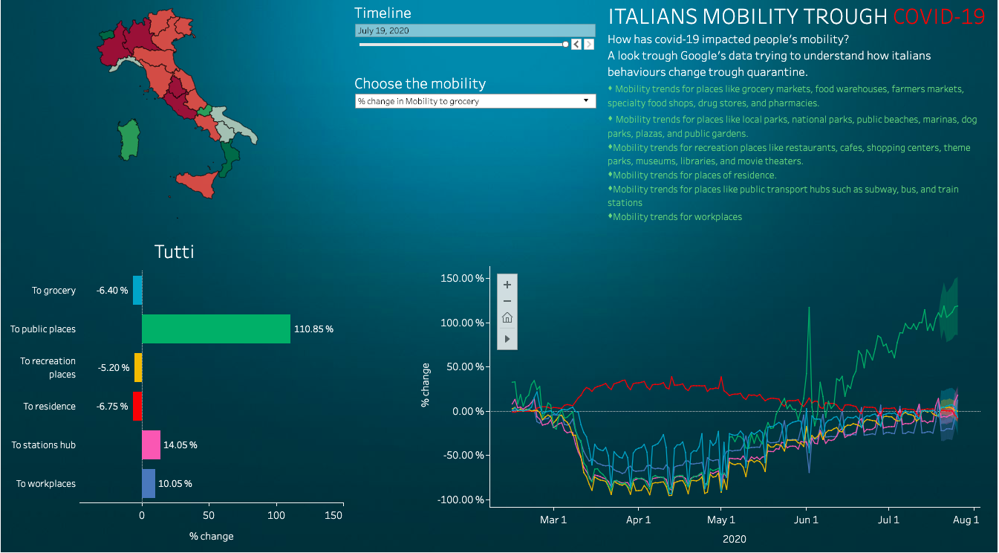

# Italian mobility trough quarantine.
How has covid-19 impacted people's mobility? A look trough Google's data trying to understand how italians behaviours change trough quarantine.
https://public.tableau.com/profile/carmine.minichini#!/vizhome/google_mobility_italy_15955349107360/DashMobility

This is a Tableau dashboard made up with Google's dataset on mobility trends during 2020. An interactive way to explore mobility changes trough covid-19 breakout.
