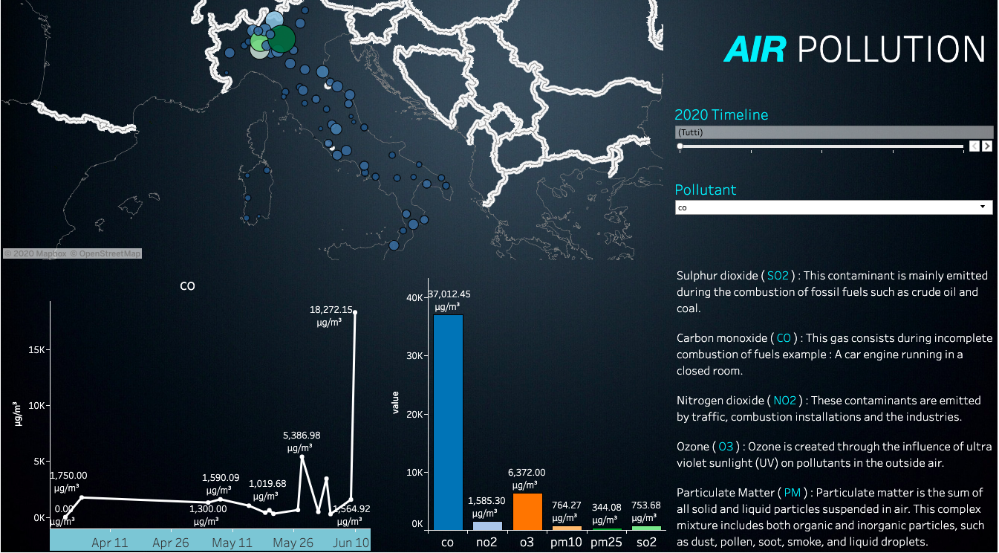

# Italian mobility trough quarantine.
How has covid-19 impacted people's mobility? A look trough Google's data trying to understand how italians behaviours change trough quarantine.
https://public.tableau.com/profile/carmine.minichini#!/vizhome/google_mobility_italy_15955349107360/DashMobility
This is a Tableau dashboard made up with Google's dataset on mobility trends during 2020. An interactive way to explore mobility changes trough covid-19 breakout.

# Air Pollution
What is the air quality in Italy in 2020? A look trough open_aq repository to understand pollutant distribution in Italy.
https://public.tableau.com/profile/carmine.minichini#!/vizhome/open_aq_query/DashOPENAQ

